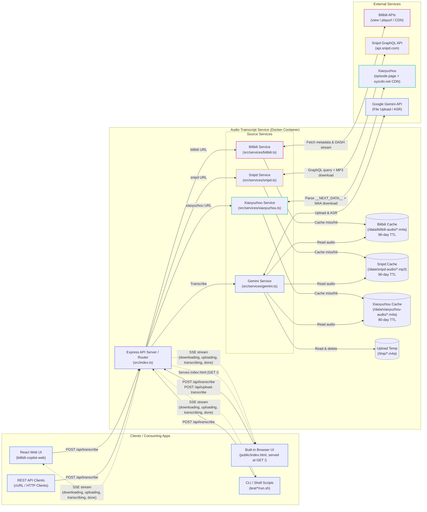

# Audio Trainscript Service

A microservice that downloads audio from Bilibili, Snipd, and Xiaoyuzhou (小宇宙) and transcribes it using the Gemini API, streamed back as Server-Sent Events (SSE). Includes a built-in browser UI for cross-platform access without scripting.

---

## System Architecture

The following diagram maps the components, network boundaries, and execution paths of the service.

### Architecture Diagram
GitHub renders this Mermaid flowchart natively:

---

## Component Overviews

### 1. Clients & Integration Layer
* **Built-in Browser UI (`public/index.html`)**: A single-page interface served directly by Express at `GET /`. Supports Bilibili URL input and `.m4a` file upload (drag-and-drop), displays real-time SSE progress, and outputs the transcript as timestamped plain text with a one-click copy action. No installation required — open `http://<host>:3001` in any browser.
* **React Web UI (`bilibili-copilot-web`)**: The downstream application that calls the service over a Tailscale connection and integrates transcription as a subtitle fallback.
* **CLI Scripts**: Helper scripts included in the repository (`test.sh` for Bilibili URLs and `transcribe-file.sh` for local files) that make raw curl requests and format the Server-Sent Events output.
* **cURL/REST API**: Direct HTTP API access for testing and integrations.

### 2. Audio Trainscript Service (Express Server)
* **Express API Server (`src/index.ts`)**:
  * Manages routing, file uploads (`multer` middleware), and HTTP connection lifecycles.
  * Streams real-time progress events back to clients as **Server-Sent Events (SSE)**.
  * Detects client disconnections to terminate long-running processes early.
* **Bilibili Service (`src/services/bilibili.ts`)**:
  * Resolves `b23.tv` short URLs to canonical `bilibili.com` URLs before any processing.
  * Extracts the Bilibili Video ID (`BVID`).
  * Interacts with Bilibili APIs to resolve metadata (`cid`) and stream playurls.
  * Downloads the DASH audio stream chunk-by-chunk using Axios.
* **Snipd Service (`src/services/snipd.ts`)**:
  * Extracts the episode UUID from a `share.snipd.com/episode/` URL.
  * Queries the Snipd GraphQL API for the episode's audio URL and metadata.
  * Downloads the MP3 stream with a 500 MB size limit.
* **Xiaoyuzhou Service (`src/services/xiaoyuzhou.ts`)**:
  * Extracts the 24-character hex episode ID from a `xiaoyuzhoufm.com/episode/` URL.
  * Fetches the public episode page and parses the `__NEXT_DATA__` JSON block to obtain the audio URL and metadata — no API token required.
  * Downloads the M4A stream from the public `xyzcdn.net` CDN with a 500 MB size limit.
* **Gemini Service (`src/services/gemini.ts`)**:
  * Authenticates using `GEMINI_API_KEY` and initializes the `@google/genai` client.
  * Uploads audio files to the Google AI Studio Files API.
  * Polls the file processing status until it is ready (`PROCESSING` -> `ACTIVE`).
  * Invokes the Gemini API `generateContent` with a prompt embedding episode metadata (title, speaker, description) for context-aware ASR.
  * Returns the transcript verbatim and cleans up the uploaded file from Google AI Studio on completion.
  * Scans and cleans up orphaned Gemini files older than 1 hour on startup.
* **Audio Caches** (`/data/bilibili-audio/`, `/data/snipd-audio/`, `/data/xiaoyuzhou-audio/`):
  * Each source has its own persistent named Docker volume. Files are keyed by episode/video ID with a 90-day sliding TTL — a cache hit refreshes mtime and skips the download entirely.
* **Upload Temp** (`/tmp/`):
  * Temporary directory used exclusively to stage `.m4a` files uploaded by clients via `/api/upload-transcribe`. Cleaned up immediately after transcription or on error.

### 3. External API Dependencies
* **Bilibili APIs**: Used to resolve stream URLs and download audio. Requires `BILIBILI_SESSION_TOKEN` (the `SESSDATA` cookie) for authenticated request access.
* **Snipd GraphQL API** (`api.snipd.com`): Queried with the episode UUID to fetch the MP3 audio URL and metadata. No authentication required.
* **Xiaoyuzhou Episode Page + CDN** (`xiaoyuzhoufm.com` / `xyzcdn.net`): The public episode page embeds full episode JSON in a `__NEXT_DATA__` block; the CDN serves M4A audio publicly. No authentication required.
* **Google Gemini API / AI Studio**: Receives audio uploads and performs ASR (Automated Speech Recognition) utilizing models such as `gemini-2.5-flash-lite`.

### Rate limits

URL transcriptions run through an asynchronous queue drained by a single worker, which is the only component that calls Gemini. Per-model requests-per-minute (RPM) and requests-per-day (RPD) limits are read from [`config/rate-limits.json`](./config/rate-limits.json) — edit `default` and per-model `models` entries to match your Gemini quota. Override the path with `RATE_LIMITS_PATH` if needed.

---

## Detailed Usage Instructions

For local installation, Docker deployment, API formats, and testing scripts, please refer to the **[USAGE.md](./USAGE.md)** guide.
