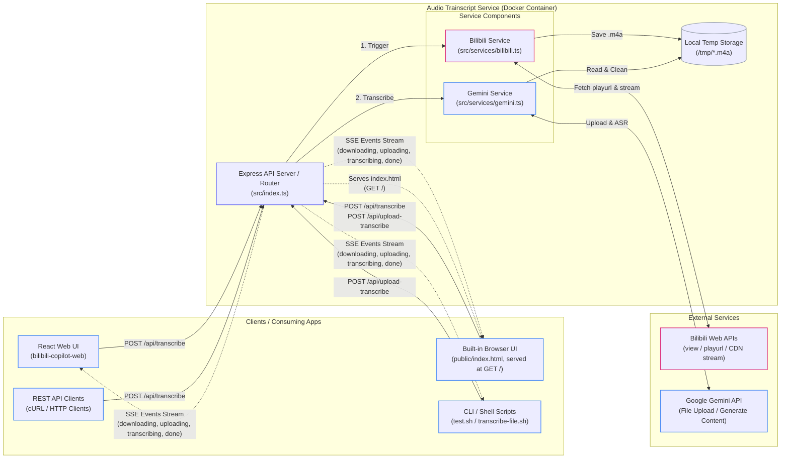

# Audio Trainscript Service

A microservice that downloads audio from Bilibili videos and transcribes them using the Gemini API, streamed back as Server-Sent Events (SSE). Includes a built-in browser UI for cross-platform access without scripting.

---

## System Architecture

The following diagram maps the components, network boundaries, and execution paths of the service.

### Architecture Diagram
GitHub renders this Mermaid flowchart natively:

---

## Component Overviews

### 1. Clients & Integration Layer
* **Built-in Browser UI (`public/index.html`)**: A single-page interface served directly by Express at `GET /`. Supports Bilibili URL input and `.m4a` file upload (drag-and-drop), displays real-time SSE progress, and outputs the transcript as timestamped plain text with a one-click copy action. No installation required — open `http://<host>:3001` in any browser.
* **React Web UI (`bilibili-copilot-web`)**: The downstream application that calls the service over a Tailscale connection and integrates transcription as a subtitle fallback.
* **CLI Scripts**: Helper scripts included in the repository (`test.sh` for Bilibili URLs and `transcribe-file.sh` for local files) that make raw curl requests and format the Server-Sent Events output.
* **cURL/REST API**: Direct HTTP API access for testing and integrations.

### 2. Audio Trainscript Service (Express Server)
* **Express API Server (`src/index.ts`)**:
  * Manages routing, file uploads (`multer` middleware), and HTTP connection lifecycles.
  * Streams real-time progress events back to clients as **Server-Sent Events (SSE)**.
  * Detects client disconnections to terminate long-running processes early.
* **Bilibili Service (`src/services/bilibili.ts`)**:
  * Extracts the Bilibili Video ID (`BVID`).
  * Interacts with Bilibili APIs to resolve metadata (`cid`) and stream playurls.
  * Downloads the DASH audio stream chunk-by-chunk using Axios.
* **Gemini Service (`src/services/gemini.ts`)**:
  * Authenticates using `GEMINI_API_KEY` and initializes the `@google/genai` client.
  * Uploads audio files to the Google AI Studio Files API.
  * Polls the file processing status until it is ready (`PROCESSING` -> `ACTIVE`).
  * Invokes the Gemini API `generateContent` using a targeted prompt instructing it to output structured JSON with timestamp ranges (`from`/`to`) and transcription segment text.
  * Robustly parses and repairs Gemini JSON outputs (handling markdown fences, missing key quotes, and bounding box formats).
  * Automatically cleans up the uploaded file from Google AI Studio on completion.
  * Scans and cleans up orphaned Gemini files older than 1 hour on startup.
* **Local Temp Storage**:
  * Temporary directory (`/tmp`) on the local filesystem used to stage download streams from Bilibili or uploaded multipart files from clients, which are cleaned up immediately after upload/error.

### 3. External API Dependencies
* **Bilibili APIs**: Used to resolve stream URLs and download audio. Requires `BILIBILI_SESSION_TOKEN` (the `SESSDATA` cookie) for authenticated request access.
* **Google Gemini API / AI Studio**: Receives audio uploads and performs ASR (Automated Speech Recognition) utilizing models such as `gemini-3.1-flash-lite`.

---

## Detailed Usage Instructions

For local installation, Docker deployment, API formats, and testing scripts, please refer to the **[USAGE.md](./USAGE.md)** guide.
