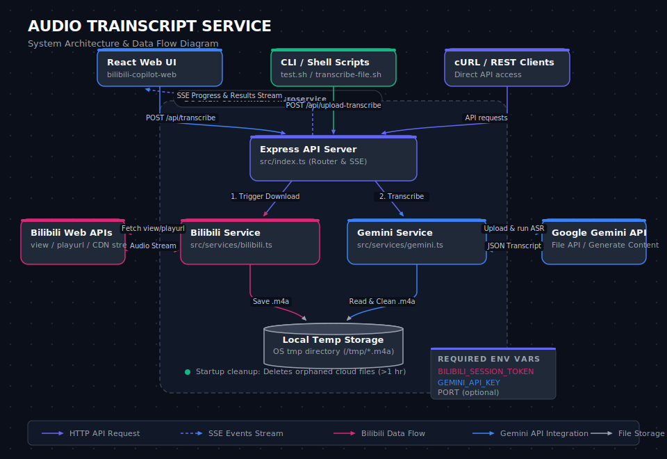

# Audio Trainscript Service — System Architecture & Diagram

This document describes the architecture, component relationships, and data flows of the **Audio Trainscript Service**.

## System Diagram

The system diagram is generated as a vector SVG and can be viewed directly:
👉 **[View Vector SVG Diagram (system_diagram.svg)](./system_diagram.svg)**

*Below is the diagram rendering (if supported by your markdown viewer):*



---

## Native Mermaid Diagram

For an interactive or editable flowchart, you can view the Mermaid diagram below (GitHub renders this natively):

```mermaid
flowchart TB
    subgraph Clients ["Clients / Consuming Applications"]
        direction LR
        Web["React Web UI<br/>(bilibili-copilot-web)"]
        CLI["CLI / Shell Scripts<br/>(test.sh / transcribe-file.sh)"]
        cURL["REST API Clients<br/>(cURL / HTTP Clients)"]
    end

    subgraph Service ["Audio Trainscript Service (Docker Container)"]
        direction TB
        Router["Express API Server / Router<br/>(src/index.ts)"]
        BiliSrv["Bilibili Service<br/>(src/services/bilibili.ts)"]
        GeminiSrv["Gemini Service<br/>(src/services/gemini.ts)"]
        TempDisk[("Local Temp Storage<br/>(/tmp/*.m4a)")]
    end

    subgraph External ["External Services"]
        direction TB
        BiliAPI["Bilibili Web APIs<br/>(view / playurl / CDN stream)"]
        GeminiAPI["Google Gemini API<br/>(File Upload / Generate Content)"]
    end

    %% Client Interactions
    Web -->|POST /api/transcribe| Router
    CLI -->|POST /api/upload-transcribe| Router
    cURL -->|POST /api/transcribe| Router
    Router -.->|SSE Events Stream<br/>(downloading, uploading, transcribing, done)| Web
    Router -.->|SSE Events Stream| CLI
    Router -.->|SSE Events Stream| cURL

    %% Router to Services
    Router -->|1. Trigger Download| BiliSrv
    Router -->|2. Transcribe| GeminiSrv

    %% Bilibili Flow
    BiliSrv <-->|Fetch view & playurl| BiliAPI
    BiliAPI -->|Audio Stream| BiliSrv
    BiliSrv -->|Write temp .m4a| TempDisk

    %% Gemini Flow
    GeminiSrv -->|Read & Clean .m4a| TempDisk
    GeminiSrv -->|Upload & run ASR| GeminiAPI
    GeminiAPI -->|JSON Transcript| GeminiSrv
```

---

## Component Descriptions

### 1. Clients & Integration Layer
* **React Web UI (`bilibili-copilot-web`)**: The user interface that calls the service over a Tailscale connection and displays progress state (downloading, uploading, transcribing) in real-time.
* **CLI Scripts**: Helper scripts included in the repository (`test.sh` for Bilibili URLs and `transcribe-file.sh` for local files) that make raw curl requests and format the Server-Sent Events output.
* **cURL/REST API**: Direct HTTP API access for testing and integrations.

### 2. Audio Trainscript Service (Express Server)
* **Express API Server (`src/index.ts`)**:
  * Manages routing, file uploads (`multer` middleware), and HTTP connection lifecycles.
  * Streams real-time progress events back to clients as **Server-Sent Events (SSE)**.
  * Detects client disconnections to terminate long-running processes early.
* **Bilibili Service (`src/services/bilibili.ts`)**:
  * Extracts the Bilibili Video ID (`BVID`).
  * Interacts with Bilibili APIs to resolve metadata (`cid`) and stream playurls.
  * Downloads the DASH audio stream stream-by-stream using Axios.
* **Gemini Service (`src/services/gemini.ts`)**:
  * Authenticates using `GEMINI_API_KEY` and initializes the `@google/genai` client.
  * Uploads audio files to the Google AI Studio Files API.
  * Polls the file processing status until it is ready (`PROCESSING` -> `ACTIVE`).
  * Invokes the Gemini API `generateContent` using a targeted prompt instructing it to output structured JSON with timestamp ranges (`from`/`to`) and transcription segment text.
  * Robustly parses and repairs Gemini JSON outputs (handling markdown fences, missing key quotes, and bounding box formats).
  * Automatically cleans up the uploaded file from Google AI Studio on completion.
  * Scans and cleans up orphaned Gemini files older than 1 hour on startup.
* **Local Temp Storage**:
  * Temporary directory (`/tmp`) on the local filesystem used to stage download streams from Bilibili or uploaded multipart files from clients, which are cleaned up immediately after upload/error.

### 3. External API Dependencies
* **Bilibili APIs**: Used to resolve stream URLs and download audio. Requires `BILIBILI_SESSION_TOKEN` (the `SESSDATA` cookie) for authenticated request access.
* **Google Gemini API / AI Studio**: Receives audio uploads and performs ASR (Automated Speech Recognition) utilizing models such as `gemini-3.1-flash-lite`.

---

## Key Data Flows

### A. Bilibili Audio Transcription Flow (`/api/transcribe`)
1. **Client** initiates a `POST` request with a Bilibili URL.
2. **Express Server** opens an SSE connection (`text/event-stream`).
3. **Bilibili Service** resolves the video info, requests the audio playurl, and downloads the stream into a local temp file, emitting `downloading` events.
4. **Gemini Service** uploads the temp file to the Google Files API (sending `uploading` events) and waits for it to process.
5. **Gemini Service** triggers the LLM for transcription, emitting `transcribing` events.
6. **Gemini Service** receives raw JSON transcript, parses/repairs it, and streams the array back as a `done` event.
7. The local temp file is deleted from the server disk and the file is deleted from Gemini Files storage.

### B. Local File Upload Transcription Flow (`/api/upload-transcribe`)
1. **Client** uploads a local `.m4a` file using `multipart/form-data`.
2. **Express Server** saves the file to `/tmp` via Multer, and opens an SSE stream.
3. Steps 4-7 from the Bilibili flow are executed to upload to Gemini, transcribe, return results, and clean up.
